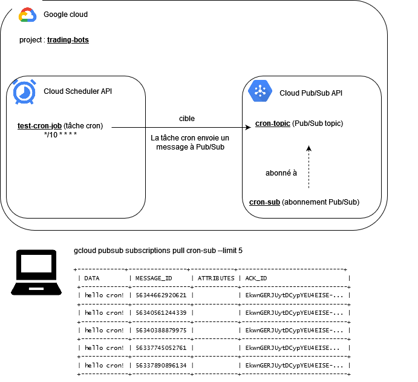
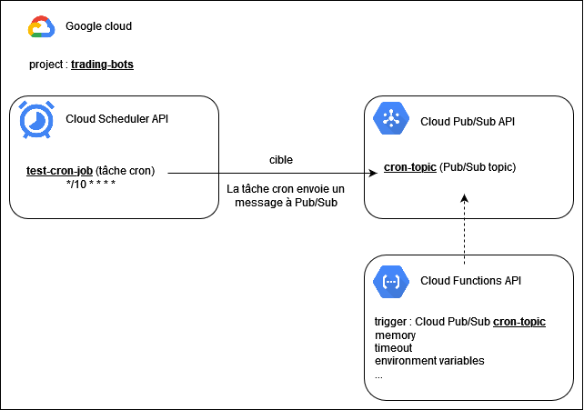

# gcloud-bot

## v1

[https://cloud.google.com/scheduler/docs/schedule-run-cron-job](https://cloud.google.com/scheduler/docs/schedule-run-cron-job)



## nettoyage

On n'a plus besoin de la subscription
```
gcloud pubsub subscriptions delete cron-sub
```

## v2

[https://cloud.google.com/scheduler/docs/tut-pub-sub](https://cloud.google.com/scheduler/docs/tut-pub-sub)

